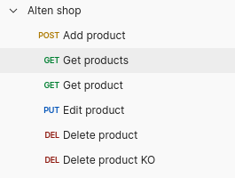

## Pour tester
### En local sur un environnement de dev fonctionnel :

Depuis altern-shop-springboot-back sudo docker-compose start   -d mongobd  &  ./mwnw spring-boot:run

### Avec docker  :

Depuis altern-shop-springboot-back : docker build -t alten-shop-api . & docker-compose up -d

### Utiliser la collection postman pour tester les APIs ([Alten shop.postman_collection.json](Alten%20shop.postman_collection.json))

